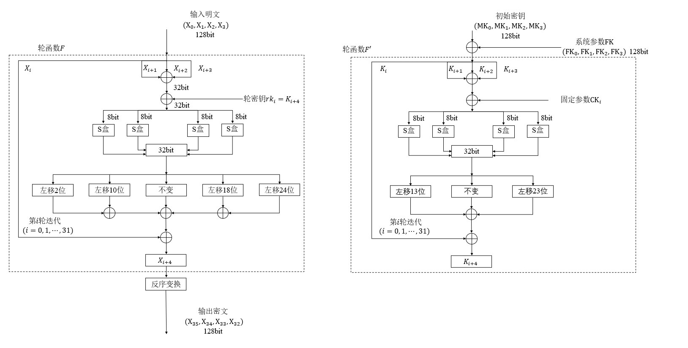

# 项目介绍

本项目实现了国密对称加密算法 SM4 的多个版本，包括基础实现、AES-NI 指令优化版本和 T-table 查找表等其他优化版本，并提供了测试和基准评估工具。通过对比不同实现的性能，验证优化策略的效果。最后实现了 GCM 加密模式以及借助查找表的优化。

## 项目结构

```bash
.
├── README.md             # 项目说明文档  
├── benchmark.c           # 基准测试主程序
├── main.c                # 正确性测试主程序  
├── makefile              # 构建脚本，支持编译、测试和清理  
├── sm4.c                 # SM4 基础实现  
├── sm4.h                
├── sm4_aesni.c           # 使用 AES-NI 指令优化的实现  
├── sm4_aesni.h            
├── sm4_opt.c             # 其他优化版本实现  
└── sm4_opt.h               
```

## 使用方法

正确性验证：

(注：正确性验证用到的示例来自[官方文档](http://www.gmbz.org.cn/main/viewfile/20180108015408199368.html))
```bash
make
```

benchmark基准测试：
```bash
make bm
```

清理产生的文件
```bash
make clean
```

# 实现原理

## SM4 基础实现原理

本项目实现的 SM4 算法遵循国家密码管理局发布的《GM/T 0002-2012 SM4分组密码算法》标准，主要包括三部分：**加解密过程**、**密钥扩展** 以及 **解密过程**。

---

### （1）加解密过程

SM4 对 128 位输入明文进行加密，将其拆分为 4 个 32 位的字：

$$
X_0, X_1, X_2, X_3
$$

之后执行 32 轮迭代，每一轮的计算如下：

1. **构造输入：**

$$
B = X_{i+1} \oplus X_{i+2} \oplus X_{i+3} \oplus rk_i
$$

2. **非线性变换（S 盒）**：

将 $B$ 拆成 4 个字节，分别查 S 盒替换后重新组合为 32 位数据 $B'$ 。

3. **线性变换 $T$：**

$$
T(B) = B' \oplus (B' \lll 2) \oplus (B' \lll 10) \oplus (B' \lll 18) \oplus (B' \lll 24)
$$

4. **更新状态：**

$$
X_{i+4} = X_i \oplus T(B)
$$

共执行 32 轮，最终将输出按逆序组合：

$$
\text{Output} = X_{35} || X_{34} || X_{33} || X_{32}
$$

---

### （2）密钥扩展（Key Expansion）

初始密钥为 128 位，记为：

$$
MK_0, MK_1, MK_2, MK_3
$$

先与固定参数 $FK_i$ 异或：

$$
K_0 = MK_0 \oplus FK_0 \\
K_1 = MK_1 \oplus FK_1 \\
K_2 = MK_2 \oplus FK_2 \\
K_3 = MK_3 \oplus FK_3
$$

然后进行 32 轮扩展，生成轮密钥 $rk_0$ 到 $rk_{31}$ ：

1. **构造输入：**

$$
B = K_{i+1} \oplus K_{i+2} \oplus K_{i+3} \oplus CK_i
$$

2. **S 盒变换得到 $B'$**

3. **线性变换 $T'$：**

$$
T'(B) = B' \oplus (B' \lll 13) \oplus (B' \lll 23)
$$

4. **更新状态与输出轮密钥：**

$$
K_{i+4} = K_i \oplus T'(B) \\
rk_i = K_{i+4}
$$

---

### （3）解密过程

SM4 解密使用与加密相同的算法结构，只需将轮密钥反序使用：

$$
rk_i^{\prime} = rk_{31 - i}
$$

然后重复加密流程，即可还原出原始明文。

---

### （4）轮函数表示

定义 SM4 轮函数：

$$
F(X_i, X_{i+1}, X_{i+2}, X_{i+3}, rk_i) = X_i \oplus T(X_{i+1} \oplus X_{i+2} \oplus X_{i+3} \oplus rk_i)
$$

最后一轮生成：

$$
X_{35} = X_{31} \oplus T(X_{32} \oplus X_{33} \oplus X_{34} \oplus rk_{31})
$$

最终输出：

$$
X_{35}, X_{34}, X_{33}, X_{32}
$$

解密时，将这 4 个字作为输入并用逆序的轮密钥继续加密操作，即可恢复出原文。

如图：


## SM4 AESNI 优化原理

基本思想是利用 SM4 与 AES 中 S 盒结构的相似性，借助 Intel 的 AESNI 指令和 SIMD 完成 S 盒操作。

AES 的 S 盒结构如下：

$$
S_a(x) = A_a \cdot I_a(x) + C_a
$$

SM4 的 S 盒结构如下：

$$
S_s(x) = A_s \cdot I_s(A_s x + C_s) + C_s
$$

AES 使用的不可约多项式为：

$$
x^8 + x^4 + x^3 + x + 1
$$

SM4 使用的不可约多项式为：

$$
x^8 + x^7 + x^6 + x^5 + x^4 + x^2 + 1
$$

其中最耗时的部分为有限域上的求逆运算 $I(x)$ 。借助有限域之间的同构，可以构造出同构映射 $T$ ，将 SM4 中的元素映射到 AES 的域中，借助 AESNI 指令求逆后再逆映射回来。

需要注意的是，8-bit 数与矩阵的对应关系有所不同：

- 在 SM4 中： $s=b_0 b_1 \cdots b_7$ 对应向量为 $[b_0, b_1, \cdots, b_7]^T$ 
- 在 AES 中：对应向量为 $[b_7, b_6, \cdots, b_0]^T$ 

因此，可以通过修改矩阵的行列顺序进行抵消。

---

### AES 与 SM4 S 盒映射

设：

$$
y = A_s x + C_s
$$

设将 SM4 域映射到 AES 域的同构为 $T(x_s) \to x_a$ ，则：

$$
I_s(y) = T^{-1} \cdot I_a(T(y))
$$

也即：

$$
I_s(y) = T^{-1} A_a^{-1} \cdot (S_a(T(y)) + C_a)
$$

最终我们得到：

$$
S_s(x) = A_s T^{-1} A_a^{-1} \cdot S_a(T A_s x + T C_s) + A_s T^{-1} A_a^{-1} C_a + C_s
$$

设：

- $A_{map} = A_s T^{-1} A_a^{-1}$ 
- $C_{map} = A_s T^{-1} A_a^{-1} C_a + C_s$ 

则：

$$
S_s(x) = A_{map} \cdot S_a(T A_s x + T C_s) + C_{map}
$$

对应的矩阵值可以预计算

---

### 矩阵乘法优化

借助 `vpshufb` 指令，可以高效完成 4-bit 的查表运算，因此可以将 8x8 的矩阵乘法拆分为两个 4-bit 的查表操作。

记：

$$
A \cdot x = 
\begin{bmatrix}
A_{0,0} & A_{0,1} \\
A_{1,0} & A_{1,1}
\end{bmatrix}
\cdot
\left(
\begin{bmatrix}
b_7 \cdots b_4 \\
0
\end{bmatrix}
+
\begin{bmatrix}
0 \\
b_3 \cdots b_0
\end{bmatrix}
\right)
$$

即：

- 高 4 bit 对应一个 $4 \to 8$ 查表
- 低 4 bit 对应一个 $4 \to 8$ 查表

查表结果异或即可得到最终矩阵乘法结果。

---

### 算法流程

由于 AESNI 指令操作的是 128-bit 数据，而 SM4 每轮操作仅涉及 32-bit，因此将 4 组消息打包处理，使数据量为 128-bit。

#### 步骤如下：

输入消息： $M_0,M_1,M_2,M_3$

打包：

$$
X_0, X_1, X_2, X_3 \leftarrow \text{Pack}(M_0, M_1, M_2, M_3)
$$

迭代 32 轮：

```pseudo
for i = 0 → 31:
    S ← X_1 ^ X_2 ^ X_3 ^ K_i
    S ← T_A × S + T_C
    S ← AES_SBox(S)        # 使用 AESNI 指令完成
    S ← A_TA × S + A_TC
    S ← X_0 ^ L(S)
    X_0, X_1, X_2, X_3 ← X_1, X_2, X_3, S
```

解包：

$$
M_0, M_1, M_2, M_3 \leftarrow \text{Unpack}(X_3, X_2, X_1, X_0)
$$

输出： $M_0,M_1,M_2,M_3$

第 5-7 步使用了 `_mm_aesenclast_si128` 指令，该指令包含了：

- 行移位
- 字节替代（S 盒）
- 轮密钥加

为了抵消行移位和轮密钥加的副作用，需使用逆行移位 + 零轮密钥。

## SM4 T-table 优化原理

该优化方法的[参考原文](https://html.rhhz.net/ZGKXYDXXB/20180205.htm)

在 SM4 的标准实现中，S 盒操作是按字节进行的非线性替换：

$$
(x_0, x_1, x_2, x_3) \rightarrow (S(x_0), S(x_1), S(x_2), S(x_3))
$$

其中每个 $x_i$ 是一个 8 位（8bit）字节。

### 合并 S 盒与线性变换 L

SM4 中，S 盒操作之后通常需要进行线性变换 $L$，即：

$$
L(S(x_0), S(x_1), S(x_2), S(x_3)) = L(S(x_0) \ll 24) \oplus L(S(x_1) \ll 16) \oplus L(S(x_2) \ll 8) \oplus L(S(x_3))
$$

为了提升效率，我们可以将 S 盒和线性变换合并成查找表操作，预先定义 4 个 $8\text{bit} \rightarrow 32\text{bit}$ 的查找表 $T_i$：

- $T_0(x) = L(S(x) \ll 24)$
- $T_1(x) = L(S(x) \ll 16)$
- $T_2(x) = L(S(x) \ll 8)$
- $T_3(x) = L(S(x))$

那么，在实际加密过程中，只需从 32bit 输入中提取 4 个字节：

$$
x = x_0 \parallel x_1 \parallel x_2 \parallel x_3
$$

执行：

$$
T(x) = T_0(x_0) \oplus T_1(x_1) \oplus T_2(x_2) \oplus T_3(x_3)
$$

### 加密过程优化

在加密流程中，可将上述优化嵌入每一轮的加密运算，流程如下：

1. 初始输入明文 $P$ 拆分为 4 个 32bit 分组：

$$
(X_0, X_1, X_2, X_3) \leftarrow P
$$

2. 对于每一轮 $i = 0 \rightarrow 31$，计算轮函数：

    ```pseudo
    K_i ← 轮密钥
    Tmp ← X1 ^ X2 ^ X3 ^ K_i
    Tmp ← T(Tmp) ^ X0
    (X0, X1, X2, X3) ← (X1, X2, X3, Tmp)
    ```

    最终输出密文：

$$
C = (X_3,X_2,X_1,X_0)
$$

通过查表法提前合并非线性变换和线性变换，可以极大提升运行效率，尤其适合在软件实现中进行优化，是一种空间换时间的优化思想。

## 测试结果
基准测试通过分别统计两种优化策略和原版加密 10000000 个数据块的用时，计算得到处理速率，得到如下结果（单位：MB/s ）：
|      | 原版   | AESNI优化 | T-table优化 |
|:-----:|:-----:|:-----:|:-----:|
| 加密 | 119.41 | 85.03 | 194.44 |
| 解密 | 128.57 | 83.76 | 204.65 |

可能受限于电脑配置和基准测试方案缺陷，AESNI 优化效果反而不如原版

## GCM 模式原理及优化思路


GCM（Galois/Counter Mode）是一种结合了认证与加密的分组密码工作模式。  
其中，G 代表 GMAC（Galois Message Authentication Code，伽罗瓦消息认证码），C 代表 CTR（计数器模式，Counter mode）。  
GCM 模式支持同时完成数据的加密和认证，分组大小为 128 位。

在理解 GCM 原理前，需要先了解两个核心函数：

- **GHASH**：伽罗瓦域上的哈希函数，用于计算认证标签。
- **GCTR**：基于 CTR 模式的加密函数。

---

### 1. GHASH 函数

GHASH 函数是基于伽罗瓦域 $GF(2^{128})$ 乘法的哈希计算。其步骤如下：

1. 将输入字符串 $x$ 拆分为多个 128 位块：

$$
X_1, X_2, \dots, X_m
$$

2. 初始化 $Y_0 = 0^{128}$（128 位的全零），因异或性质， $Y_0$ 对第一次异或无影响，故有时省略不写。

3. 递推计算：

$$
Y_i = (Y_{i-1} \oplus X_i) \cdot H
$$

其中， $H$ 是 GHASH 的哈希子密钥。  
最终 $Y_m$ 即为 GHASH 输出的认证哈希值。

---

### 2. GCTR 函数

GCTR 是基于计数器模式的加密函数，主要负责对数据进行加密/解密，步骤如下：

1. 如果输入 $X$ 是空串，则输出空串 $Y$。

2. 计算块数：

$$
n = \lceil \frac{\text{len}(X)}{128} \rceil
$$

3. 将 $X$ 分割为：

$$
X = X_1 || X_2 || \cdots || X_{n-1} || X_n^*
$$

其中，前 $n-1$ 块都是完整的 128 位块，最后一块 $X_n^*$ 可能不完整。

4. 初始化计数器块：

$$
CB_1 = ICB
$$

其中 $ICB$ 是初始化计数器块。

5. 计算后续计数器块：

$$
CB_i = \text{inc32}(CB_{i-1}), \quad i=2,\dots,n
$$

这里的 $\text{inc32}$ 表示对计数器的低 32 位递增操作。

6. 对前 $n-1$ 块加密：

$$
Y_i = X_i \oplus \text{Enc}_{HK}(CB_i), \quad i=1,\dots,n-1
$$

其中， $\text{Enc}_{HK}(\cdot)$ 是对计数器块使用密钥 $HK$ 进行的加密。

7. 对最后可能不完整的块：

$$
Y_n^{*} = X_n^{*} \oplus 
$$

即仅取加密结果的最高位对应长度部分，与 $X_n^*$ 异或。

8. 输出加密结果：

$$
Y = Y_1 || Y_2 || \cdots || Y_{n-1} || Y_n^*
$$

---


### 优化思路

GHash 是 GCM 模式中的核心乘法认证模块，其结构与 CFB 模式类似。设每轮输入为 $X_i$，输出为 $Y_i$，则有递推关系：

$$
Y_i = (Y_{i-1} \oplus X_i) \cdot H
$$

其中初始条件：

$$
Y_1 = X_1 \cdot H
$$

乘法运算为有限域 $GF(2^{128})$ 中的乘法，输入数据块 $X_i$ 长度均为 128 位。

合并计算 $m$ 个数据块的表达式可写为：

$$
Y_m = \text{GHash}_H(X_1 | X_2 | \cdots | X_m) = \left(\cdots\left(\left(X_1 \cdot H \oplus X_2\right) \cdot H \oplus \cdots \oplus X_m \right) \cdot H \right)
$$

#### 有限域 $GF(2^{128})$ 乘法 (gmul 模块)

GCM 使用的有限域定义在不可约多项式：

$$
p(x) = 1 + x + x^2 + x^7 + x^{128}
$$

对应的比特串表示为：

$$
E_1 | (0\cdots 0)_{120}
$$

其中：

$$
E_1 = 11100001_2
$$

对任意 128 比特字符串

$$
b_0 b_1 \cdots b_{127}
$$

其多项式表示为：

$$
b_0 + b_1 x + \cdots + b_{127} x^{127}
$$

---

#### 有限域乘法的查表优化

将乘法拆分成以 8 比特为单位的累加计算：

$$
X = b_0 + b_1 x^{8} + \cdots + b_{15} x^{120}
$$

则

$$
X \cdot H = (b_0 H) + (b_1 H) \cdot x^{8} + \cdots + (b_{15} H) \cdot x^{120}
$$

进一步递推展开为：

$$
X \cdot H = \left( \left( \left( b_{15} H \cdot x^{8} + b_{14} H \right) \cdot x^{8} + \cdots \right) \cdot x^{8} + b_0 H \right)
$$

其中每个 $b_i$ 是一个 8 比特数。

因此可以预先生成查找表：

$$
\text{HTable}(a) = a \cdot H, \quad a \in [0,255]
$$

将乘法运算转化为查表操作，极大提升计算效率。

查找表可通过递推方式生成：

- 设

$$
a = a_0 + a_1 x + \cdots + a_7 x^7
$$

- 初始：

$$
\text{HTable}(0) = 0, \quad \text{HTable}(1) = H
$$

- 若最低位 $a_0 = 0$：

$$
\text{HTable}(a) = x \cdot \text{HTable}(a / x)
$$

- 若最低位 $a_0 = 1$：

$$
\text{HTable}(a) = H \oplus \text{HTable}(a - 1)
$$

其中乘以 $x^8$ 可通过左移 8 位实现，但会产生溢出位，这部分使用另一张查找表进行模约简：

$$
\text{ReduceTable}(a) = a \cdot x^{128} \equiv a \cdot (1 + x + x^2 + x^7) \mod p(x)
$$

利用该查表实现对溢出部分的快速模运算。