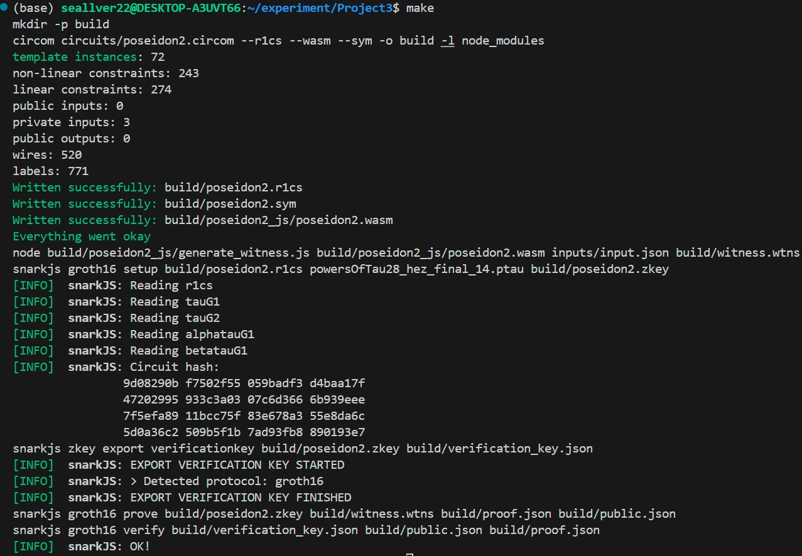

# 项目介绍
本项目使用 Circom 实现了 `t = 2` 的 Poseidon2 哈希函数的零知识电路，用 Groth16 生成证明。

## 项目结构说明

```bash 
.
├── Makefile                        # 一键构建工具，包含编译、生成证明等命令
├── README.md                       # 本文件：项目说明文档
├── build/                          # 构建生成的文件目录
│   └── ...              
├── circuits/
│   └── poseidon2.circom            # Circom 编写的 Poseidon2 哈希电路定义
├── inputs/
│   └── input.json                  # 输入文件（原像数据与哈希值），由 Rust 程序生成
├── poseidon2_input_gen/           # Rust 项目目录，用于生成输入 JSON
│   ├── Cargo.toml                  # Rust 项目配置
│   └── src/
│       └── main.rs                 # Rust 主程序：构造输入并计算 Poseidon2 哈希值
└── powersOfTau28_hez_final_14.ptau# 通用信任设置文件（Powers of Tau Phase 1）
```

## 实现原理
本项目基于 Circom + Groth16 + Poseidon2 设计了一个简洁的零知识证明系统，整体流程如下：

### 1. Poseidon2 哈希函数（t = 2）

- 使用 `t = 2`（即状态宽度为 2）版本的 **Poseidon2 哈希函数**。
- Poseidon2 是一种专为 zk-SNARK 优化的代数哈希函数，支持高效电路实现。
- 电路中实现的是 `Poseidon2([x0, x1]) → hash` 的映射。

### 2. Circom 电路设计

- 使用 Circom 编写哈希电路文件 `poseidon2.circom`。
- 电路将两个私密输入 `x0, x1` 作为 Poseidon2 的输入，并约束其输出等于一个公开输入的哈希值。
- 电路形式化表示：
  ```circom
  assert(Poseidon2(x0, x1) == public_hash);
  ```
- 编译后能生成以下文件
    - `.r1cs`：电路的 Rank-1 Constraint System，约束系统文件，描述电路的约束。
    - `.wasm`：生成的电路的 WebAssembly 文件，用来做 witness 计算（执行电路计算）。
    - `.sym`：符号文件，方便调试电路（映射变量名称）。

### 3. Trusted Setup（可信设置）

- 使用 `powersOfTau28_hez_final_14.ptau` 文件作为通用设置参数。
- 基于该参数，通过 `snarkjs` 生成 proving key 和 verifying key。

### 4. Witness 和证明生成

- 使用 Rust 脚本 `poseidon2_input_gen/src/main.rs` 生成输入 `input.json`（两个大整数 + 哈希值）。
- 使用 `poseidon2.wasm` 和 `witness_calculator.js` 计算电路的 `witness.wtns`。
- 使用 Groth16 协议生成 `proof.json` 和 `public.json`，结果在 `build` 中

### 5. 验证证明

- 使用 `verification_key.json` 和公共输入 `public.json` 验证 `proof.json` 是否正确。

整体流程大致如下：
```bash
        x0, x1  ───┐
                   │ ← (Rust 生成输入 + 哈希)
                   ▼
              input.json
                   │
                   ▼
            ┌─────────────┐
            │witness.wtns │ ← wasm + input.json + witness_calculator.js
            └──────┬──────┘
                   │
                   ▼
             ┌───────────┐
             │ proof.json│ ← groth16 prove
             └─────┬─────┘
                   │
                   ▼
       verify(proof, public, verification_key)

```


# 使用说明

## 环境依赖
- Node.js `(v23.11.0)`
- npm `(v11.3.0)`
- circom 编译器 `(v2.2.2)`
- snarkjs `(v0.7.5)`
- Rust `(rustc 1.90.0-nightly (5795086bd 2025-07-16))`

此外，需要手动安装用于 Circom 电路开发的通用标准库 circomlib，安装方法：
```bash
npm install circomlib
``` 
## 运行流程
### 1. 用 Rust 生成 witness 输入
```bash
cd poseidon2_input_gen
cargo run --release
```
这样会在 `inputs/` 中写入 `input.json`，作为witness的输入

### 2. 编译circom，生成证明并进行验证
均已用 Makefile 脚本实现自动化构建，回到 `Project3/` 主目录后
```bash
make
```
具体执行如下步骤，在 Makefile 中已标出：
- `compile`：circom编译电路
- `witness`：计算 witness（需要先运行步骤1）
- `setup`：运行 Groth16 setup 生成 zkey 文件
- `prove`：生成证明文件
- `verify`：验证证明正确性

## 运行结果

若项目正常运行且验证通过，会出现如下回显结果：

