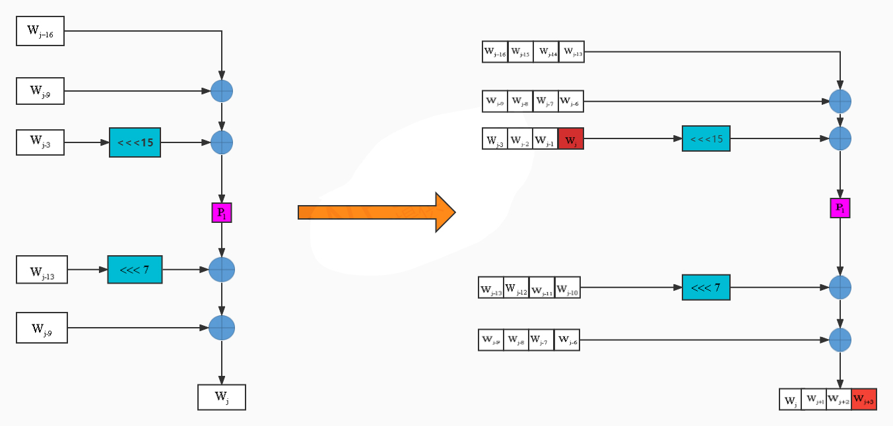

# 项目介绍

本项目实现了国密哈希算法 SM3，并基于 SIMD 实现了性能优化；演示了长度扩展攻击（Length Extension Attack）的 POC；并实现了 RFC 6962 标准的 Merkle Tree，然后构建了叶子节点的存在性和不存在性证明，并通过了测试。

## 项目结构
```bash
.
├── LenExtAtt.c # 长度扩展攻击的实现
├── LenExtAtt.h
├── MerkleTree.c # Merkle 树构造与叶子节点验证逻辑
├── MerkleTree.h 
├── MerkleTreeTest.c # Merkle 树测试用例
├── README.md # 项目说明文档
├── main.c # 主函数入口，用于测试 SM3 和长度扩展攻击
├── makefile # 构建文件
├── sm3.c # SM3 哈希算法实现
├── sm3.h
├── sm3_opt.c # SM3 优化版本
└── sm3_opt.h
```

## 使用方法

本项目使用 `Makefile` 进行构建

进行`SM3`正确性测试，`SIMD`优化的`SM3`的正确性测试，以及长度扩展攻击的POC：

（注：正确性测试使用[官方文档](https://oscca.gov.cn/sca/xxgk/2010-12/17/1002389/files/302a3ada057c4a73830536d03e683110.pdf)给的运算示例验证）
```bash
make run
```

进行10000个叶子节点构建Merkle Tree，并测试叶子节点的存在性和不存在性：
```bash
make mt
```

# 实验原理

## SM3 优化思路

SM3 具有分组长度为 512 比特（64 字节），每个字为 32 比特的结构。在实现过程中，主要包括以下三个阶段：

- 消息填充（Padding）
- 消息扩展（Message Expansion）
- 压缩函数（Compression Function）

本项目尝试使用 SIMD 指令对部分阶段进行优化，以下为各部分的分析与实现。

---

### 1. 消息填充（Padding）

SM3 对消息进行块分组，每组为 512 比特（64 字节）。若最后一组不足 64 字节，需要按照如下规则进行填充：

- 在末尾添加一个 `1` 比特；
- 然后补 `k` 个 `0` 比特，使长度变成 448 mod 512；
- 最后添加一个 64 位整数，表示原消息的比特长度。

#### 优化尝试：

- 使用 **循环展开**（loop unrolling）
- 探索 **流水线优化**（pipelining）

但由于该阶段计算量较小，且操作主要集中在字节对齐和填充判断上，因此在本次实验中未观察到显著的性能提升。

---

### 2. 消息扩展（Message Expansion）

这是 SM3 中最适合 SIMD 并行优化的部分。

#### 原始流程：

将一个 512 位消息块划分为 16 个 32 位的字 `W0 ~ W15`，然后使用如下公式扩展为 68 个字：

$$
P_1(X) = X \oplus (X \lll 15) \oplus (X \lll 23)
$$

$$
W_j = P_1(W_{j-16} \oplus W_{j-9} \oplus (W_{j-16} \lll 15)) \oplus (W_{j-13} \lll 7) \oplus W_{j+6}
$$

最后

$$
W^{\prime}_j = W_j \oplus W_{j+4}
$$


最终得到 132 个字用于压缩。

SIMD 优化方式：
使用 `__m128i`（128 位寄存器）来一次性存储并处理 4 个 32 位的 W 字，以并行计算 $W_j,W_{j+1},W_{j+2}$ 

这里注意不能一次计算 $W_j \sim  W_{j+3}$ ，因为 $W_{j+3}$ 的计算依赖于 $W_j$ ，而 $W_j$ 此时尚未完成扩展，存在数据依赖问题。解决方案：并行生成 $W_j,W_{j+1},W_{j+2}$ ，然后使用串行方式计算 $W_{j+3}$ ，然后继续下一组迭代

优化效果（理论）：
- 计算吞吐量提升约 3 倍
- 减少循环次数与寄存器访问
- 有效利用 CPU SIMD 指令集

优化前后流程示意图，[图片来源](https://github.com/ziyizhou0813/SM3-optimization/tree/sm3-v2)


---

### 3. 压缩函数（Compression Function）
压缩函数将扩展后的消息块与初始向量（IV）进行迭代计算。由于该过程为串行依赖型，即当前轮的输出将直接作为下一轮输入，无法实现有效的并行化，因此在本次优化中 未对压缩函数做并行处理。

## 长度扩展攻击原理

长度扩展攻击是针对基于Merkel-Damgård（MD）结构的哈希函数（如SM3、MD5、SHA-256等）的一种攻击方式，此攻击无需原始消息，仅需知道`Hash(M)`和`M`的长度即可完成攻击。其核心原理如下：

1. **MD结构特性**  
   - MD结构通过迭代调用压缩函数处理消息块，前一个块的输出（哈希状态）作为下一个块的输入。
   - 最终哈希值是最后一个压缩函数输出的直接结果。

2. **攻击条件**  
   - 攻击者已知原始消息`M`的哈希值`Hash(M)`及其长度（或能推断出填充后的总长度）。
   - 原始消息`M`的填充规则符合MD标准（如附加`1` + `0` + 消息长度）。

3. **攻击步骤**  
   - **构造扩展消息**：在原始消息`M`的填充后追加任意数据`M3`，形成新消息`M' = M || M3`。
   - **利用哈希状态**：将`Hash(M)`作为初始状态，继续对`M3`进行压缩计算，得到`Hash(M')`。


4. **数学表达**  
若原始消息`M`的哈希计算过程为： 

$$
Hash(M) = H_{n} = f(H_{n-1}, M_n)
$$
  
- 则扩展消息`M' = M || M3`的哈希值为：  

$$
Hash(M') = f(H_{n}, M3)
$$

### 代码实现

首先实现了标准的 SM3 算法，主要包含：
```c
//状态初始化
void sm3_init(SM3_CTX *ctx); 

//对输入数据进行分块处理，逐步更新哈希状态
void sm3_update(SM3_CTX *ctx, const uint8_t *data, uint32_t len); 

//进行最后的填充操作，完成哈希计算，并输出最终的哈希值
void sm3_final(SM3_CTX *ctx, uint8_t digest[SM3_HASH_SIZE]);
```

在模拟敌手攻击的时候就很简单，只需要先用 $H(M)$ 替换初始状态，然后计算出总长度，用 `sm3_update` 把扩展部分加进去，最后直接用 `sm3_final` 获取哈希即可。

将攻击得到的哈希和 $H(M||Padding||M_{ext})$ 对比即可完成测试

## Merkle Tree 构建与叶子节点证明

###  RFC 6962 标准的 Merkle Tree

[RFC 6962](https://datatracker.ietf.org/doc/html/rfc6962) 是 Google 提出的 **Certificate Transparency** 规范，定义了一种标准化的 Merkle Tree 构建方式，主要包括以下几个要点：

#### 节点哈希规则

- **叶子节点**（Leaf）使用如下公式计算哈希：

$$
\text{LeafHash}(M) = \text{Hash}(0x00 \| M)
$$

- **中间节点**（Inner Node）使用如下方式将左右子节点拼接并计算哈希：

$$
\text{NodeHash}(L, R) = \text{Hash}(0x01 \| L \| R)
$$

> 说明：
> - $M$ ：原始数据块（如证书、交易等）；
> - $L,R$ ：左右子节点哈希值；
> - $0x00$ , $0x01$ ：分别表示叶子节点和中间节点的前缀标识；
> - 所有哈希函数使用 SM3 或其他安全哈希函数。


#### Merkle Tree 构建步骤

1. 将所有原始数据块作为叶子节点，对每个叶子节点计算 `LeafHash`；
2. 相邻两个节点拼接后添加前缀 `0x01`，再进行哈希，得到其父节点；
3. 若叶子数量为奇数，最后一个节点可以直接上移；
4. 重复该过程，直到只剩下一个节点，即为 **Merkle Root**。

---

### 叶子节点的存在性证明

Merkle 证明用于验证某个数据是否存在于 Merkle Tree 中，方法如下：
1. 获取目标叶子节点的哈希值；
2. 收集从该节点到根节点路径上所有兄弟节点的哈希值（称为认证路径）；
3. 按照构建顺序逐层拼接并计算哈希，直到根节点；
4. 如果计算出的根节点与原始 Merkle Root 匹配，则说明该数据存在于树中。

---

### 叶子节点的不存在性证明
基于 **Sorted Merkle Tree**（交易ID按字典序排序的默克尔树）的结构特性，不存在性证明可通过以下步骤实现：

#### **核心原理**
1. **排序保证**  
   - 所有叶子节点（交易ID）按严格升序/降序排列，使得任意目标交易`X`若不存在，必然位于两个相邻节点`pre`和`next`之间（满足`pre < X < next`）。

2. **相邻性验证**  
   - 通过验证`pre`和`next`的存在性及其在树中的相邻性，间接证明`X`不存在。

#### **具体方案步骤**
1. **生成相邻节点的存在性证明**  
   - 获取目标`X`的前驱`pre`和后继`next`的交易ID及其对应的 **Merkle Block Message**（包含认证路径和Merkle Root）。  
   - 验证`pre`和`next`的Merkle Root与区块链中的区块头一致，确认两者属于同一交易列表。

2. **验证相邻性**  
   - 检查`pre`和`next`的 **TXID Nodes Index** 是否连续（如`index(pre) + 1 = index(next)`）。  
   - 由于叶子节点有序，连续的索引值证明两者在交易列表中实际相邻。

3. **范围确认**  
   - 若满足`pre < X < next`且`pre`与`next`相邻，则`X`不存在于树中。

这种不存在性的证明，仅需两次存在性证明（`pre`和`next`），无需遍历整个树，实现效率较高。

### 代码实现

树的构造：
- 平衡树结构：通过 `LargestPowerOfTwoLessThan()` 动态分割左右子树，确保树的高度最小化，提升查询效率。
- 递归构建：使用分治策略递归调用 `BuildEngineeringMerkleTree()` 生成子树

存在性证明依赖两个函数：
- 认证路径生成：`BuildInclusiveProof()` 根据叶子节点索引动态生成路径上的兄弟节点哈希，用于快速生成认证路径
- 验证逻辑：`ComputVrfyRoot()` 通过重新计算根哈希并与原始 Merkle Root 比对，实现快速验证

不存在性证明：
- 二分查找待证叶子插入位置：`find_insert_pos()`
- 构造插入位置前后两个相邻叶子的存在性证明：`BuildExclusiveProof()`
